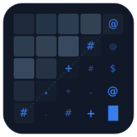

<div align="center">



# ASCII

### Turn any image into ASCII art — right in your browser.

<p>
  
  
  
  
</p>

`$@B%8&WM#*oahkbdpqwmZO0QLCJYXzcvunxrjft/\|()1{}[]?-_+~<>i!lI;:,"^\`'. `

</div>

---

Drop in a `.jpg`, `.png`, or `.webp` and watch it get read pixel-by-pixel off
a hidden `<canvas>`, mapped to luminance, and reassembled into pure text —
no libraries, no shortcuts. Just the raw conversion pipeline, built from
scratch.

## ✨ Features

| | |
|---|---|
| 📁 | Upload any image (`.jpg`, `.png`, `.webp`) |
| 🖼️ | Automatic resizing to a configurable output width |
| ⚡ | Fast pixel processing via a hidden HTML canvas |
| 🔤 | Luminance-based pixel → ASCII character mapping |
| 🎚️ | **Contrast** slider |
| 🌗 | **Brightness** slider |
| 📏 | **Output width** slider (50 – 400px) |
| 🔠 | **Character set** picker — Simple, Detailed, Blocks, Binary, Letters, Matrix, Hex, Braille |
| 🌙☀️ | **Dark / light** theme toggle, built on OKLCH design tokens |
| 📋 | **Copy** to clipboard |
| 💾 | **Download** as `.txt` |
| ↺ | **Reset** to defaults |
| 📱 | Responsive two-column workspace, collapses to one column on small screens |
| 🎬 | Subtle motion — entrance staggers, hover micro-interactions, a gently breathing empty state (all disabled under `prefers-reduced-motion: reduce`) |

## 📸 How It Works

```
image  →  canvas  →  pixels  →  luminance  →  characters  →  ASCII art
```

1. **Upload** an image.
2. It's drawn onto a hidden canvas, resized to the selected output width.
   Rows are scaled ×0.5 to compensate for the ~2:1 aspect ratio of
   monospace cells, so the exported text looks right in a terminal or editor.
3. The canvas extracts every pixel's RGBA values.
4. Each pixel's brightness is calculated:

   ```text
   Brightness = 0.299R + 0.587G + 0.114B
   ```

5. Brightness and contrast adjustments are applied, then the result is
   mapped to a character from a density ramp. The *Detailed* set, for
   example:

   ```text
   $@B%8&WM#*oahkbdpqwmZO0QLCJYXzcvunxrjft/\|()1{}[]?-_+~<>i!lI;:,"^`'.
   ```

6. On screen, the preview is re-stretched vertically ~2× via `line-height`
   so what you see matches what you'll get when you paste the export.

## 🛠️ Tech Stack

- **React 19** + **Vite**
- JavaScript (ES modules)
- HTML5 Canvas API
- Plain CSS with OKLCH color tokens — no CSS framework
- `lucide-react`, `react-icons` for UI icons

## 📂 Project Structure

```text
src/
├── components/
│   ├── ImageUpload.jsx   # hidden file input + dropzone label
│   ├── Canvas.jsx        # hidden helper canvas, extracts pixel data
│   ├── Ascii.jsx         # pixel → character mapping + copy/download
│   └── Footer.jsx        # social links + footer
├── App.jsx               # shell, workspace, state, theme toggle
├── App.css               # full design system
├── index.css             # global tokens, themes, scrollbar, reduced-motion
└── main.jsx
public/
├── logo.svg              # app icon / favicon source
└── icons.svg
```

## 🚀 Getting Started

```bash
# clone
git clone https://github.com/hissaneomaradam/ASCII.git
cd ASCII

# install
npm install

# run the dev server
npm run dev

# build for production
npm run build

# preview the production build
npm run preview

# lint
npm run lint
```

## 💡 Roadmap

- [✔️] 🎨 Colored ASCII mode
- [  ] 🖼️ Export as PNG
- [  ] 🎥 Real-time webcam ASCII
- [  ] ↩️ Invert / flip output
- [  ] 🔡 Custom, user-defined character set field

<details>
<summary>Already shipped ✅</summary>

Cleaner UI/UX, colored ASCII mode, dark/light themes, brightness slider, adjustable output
resolution, custom character sets, export as `.txt`, and copy to clipboard.

</details>

## ⭐ Why I Built This

I wanted to understand how image processing actually works in the browser,
using nothing but the Canvas API. Rather than reaching for an existing
library, I built the full conversion pipeline myself — from reading raw
pixel data to generating ASCII characters based on image luminance.

It turned into a solid crash course in image manipulation, React state
management, and rendering performance.

---

<div align="center">

If you like this project, consider giving it a ⭐ on GitHub!

</div>
